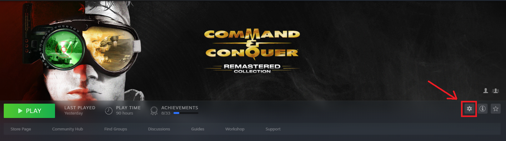
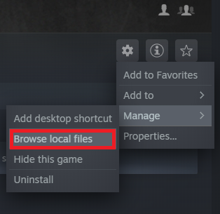
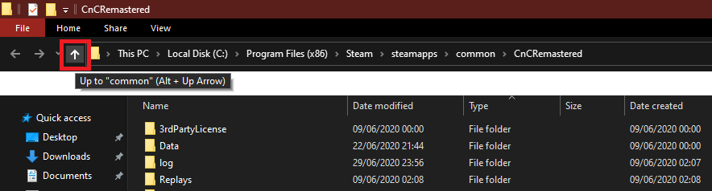
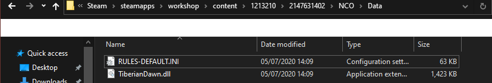

# 🛠 New Construction Options 🛠

This is a mod for the remastered version of C&C Tiberian Dawn.

It aims to make Tiberian Dawn as customisable as possible through configuration and scripting without having to modify source code directly.

The key goal is to overcome the limitation of only having one `dll` based mod loaded into the game at a time.

- [Features](#Features)
- [How to Use](#How-To-Use)
- [Installing](#Installing)
  - [Using Steam Workshop](#Using-Steam-Workshop)
  - [Manual Install](#Manual-Install)
- [RULES.INI Location](#RULESINI-Location)
  - [Steam Workshop](#Steam-Workshop)
  - [Manual Installation](#Manual-Installation)

---

## Features

- 📃 Full `RULES.INI` support for Tiberian Dawn - majority of constants are now read from a rules file if present

- ⚙ Scripting support using `Lua 5.3` - run your game logic on different menu and in-game events

---

## How to Use

There is a wiki with pages that detail how to edit the `RULES.INI` file and create Lua scripts.

See the [New Construction Options Wiki](https://github.com/djfdyuruiry/cnc-td-nco-mod/wiki)

---

## Installing

### Using Steam Workshop

- Open Steam
- Find C&C Remastered in your Game Library
- Click on `Workshop`
- Search for `New Construction Options`
- Click `Subscribe` 
- Once it has downloaded:
  - Start C&C
  - Enable the `New Construction Options` mod in the options menu
  - Restart C&C

### Manual Install

- Go the the [Releases Page](https://github.com/djfdyuruiry/cnc-td-nco-mod/releases)
- Download the latest `cnc-td-mod-vX.X.zip` file
- Open the Start menu
- Type `Run`
- Click on the `Run` app that is highlighted
- Copy and paste this: `explorer "%USERPROFILE\Documents\CnCRemastered\Mods\Tiberian_Dawn"`
- Click `OK`
- Unzip the downloaded file into this folder
- Start C&C
- Enable the `New Construction Options` mod in the options menu
- Restart C&C

---

## RULES.INI Location

The `RULES.INI` file and Lua Scripts are stored inside the mod folder. To find this folder, follow the steps below.

### Steam Workshop

- Open Steam
- Find C&C Remastered in your Game Library
- Click the cog icon:

  

- Click `Manage`, then click `Browse local files`:

  

- Click `Up` twice:

  

- Open the `workshop` folder
  - next, open `content`
  - next, open `1213210`
  - next, open `2147631402`
  - next, open `NCO`
  - next, open `Data`

    

- Copy the `RULES-DEFAULT` file and name the copy `RULES` (new releases of the mod will update `RULES-DEFAULT` so don't edit that file directly)

### Manual installation

- Open the Start menu
- Type `Run`
- Click on the `Run` app that is highlighted
- Copy and paste this: `explorer "%USERPROFILE\Documents\CnCRemastered\Mods\Tiberian_Dawn\nco\Data"`
- Click `OK`
- Copy the `RULES-DEFAULT` file and name the copy `RULES` (new releases of the mod will update `RULES-DEFAULT` so don't edit that file directly)

